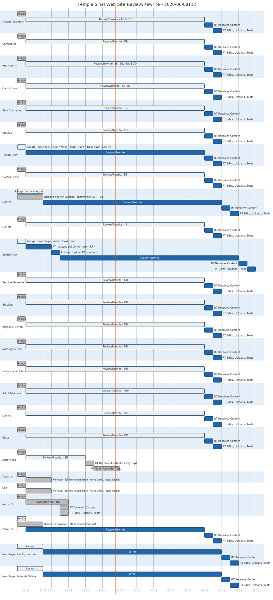
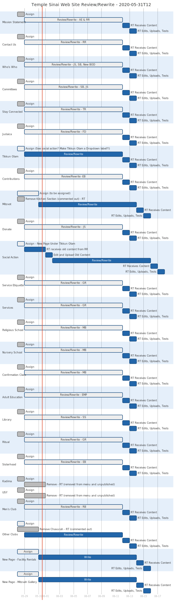
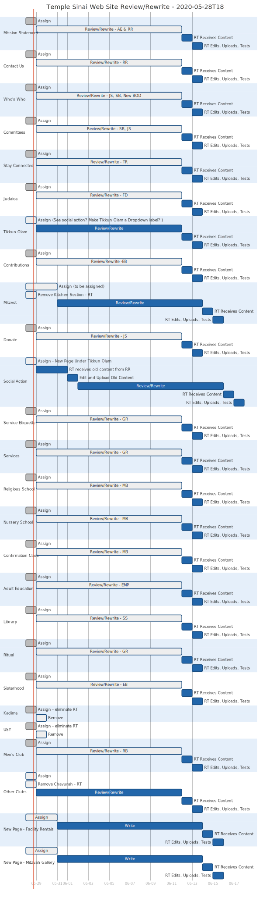

# Web Site Rewrite Project

We're kicking this off at the end of May, beginning of June. We'll assign each page to its appropriate group/person and Rich will update the site pages with the contributed content.

2020-05-27T11-04:00 - Sent e-mail to Jo for assignment suggestions. Sent my list.

I'll be using Gantt charts to track progress.

Notes:

- Most recent chart appears first.
- The bottom horizontal axis is a date labeled timeline.
- Dark gray tasks are done.
- Light gray tasks with a blue border are in progress.
- Dark blue tasks are to be done after tasks in progress
- Red tasks are critical.
- My comments and questions precede each graphic.

### Gantt Chart as of June 08, 2020-06-08T12

Given that two pages are done and the rabbi selection is ongoing I'm pushing the timeline out another week. The estimated finish is June 24.

### Gantt Chart as of May 31, 2020-05-31T12

Did this stuff:

- Commented out Kitchen section on "Mitzvot" page.
- Removed Kadima and USY pages from activities menu. Unpublished both pages.
- Commented out Chavura section on "Other Clubs" page.

All questions from last gantt remain open.

### Gantt Chart as of May 28, 2020-05-28T18

I'm still not clear who has been assigned the following pages:
- Tikkun Olam
- Mitzvot
- Social Action
- Other Clubs
- Facility Rentals
- Mitzvah Gallery

We have to fix the menu order for these:
- Tikkun Olam
- Social Action

**Is the current "Tikkun Olam" page what will become the "Social Action" page?**

We have to assign writers and find menu spots for these new pages:
- Facility Rentals
- Mitzvah Gallery

With a rewrite window of two weeks we are looking at a completion date of June 17, 2020.

## Resources

* [PlantText UML Editor](https://www.planttext.com/)
* [Mermaid live editor](https://mermaid-js.github.io/mermaid-live-editor/#/edit/eyJjb2RlIjoiZ2FudHRcbiAgICB0aXRsZSBBIEdhbnR0IERpYWdyYW1cbiAgICBkYXRlRm9ybWF0ICBZWVlZLU1NLUREXG4gICAgc2VjdGlvbiBTZWN0aW9uXG4gICAgQSB0YXNrICAgICAgICAgICA6YTEsIDIwMTQtMDEtMDEsIDMwZFxuICAgIEFub3RoZXIgdGFzayAgICAgOmFmdGVyIGExICAsIDIwZFxuICAgIHNlY3Rpb24gQW5vdGhlclxuICAgIFRhc2sgaW4gc2VjICAgICAgOjIwMTQtMDEtMTIgICwgMTJkXG4gICAgYW5vdGhlciB0YXNrICAgICAgOiAyNGQiLCJtZXJtYWlkIjp7InRoZW1lIjoiZGVmYXVsdCJ9fQ)