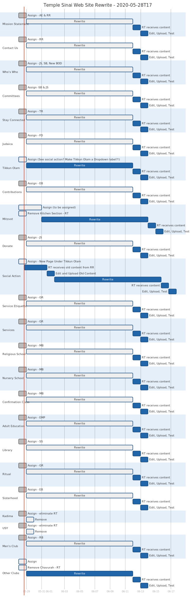

# Web Site Rewrite Project

We're kicking this off at the end of May, beginning of June. We'll assign each page to its appropriate group/person and Rich will update the site pages with the contributed content.

2020-05-27T11-04:00 - Sent e-mail to Jo for assignment suggestions. Sent my list.

## Gantt Charts (most recent first)

- The bottom horizontal axis is a date labeled timeline.
- Dark gray tasks are done.
- Light gray tasks with a blue border are in progress.
- Dark blue tasks are to be done after tasks in progress
- Red tasks are critical.

### May 28, 2020-05-28T17 

I'm still not clear who has been assigned the following pages:
- Tikkun Olam
- Mitzvot
- Social Action
- Other Clubs
- Facility Rental
- Mitzvah Gallery

## Resources

* [PlantText UML Editor](https://www.planttext.com/)
* [Mermaid live editor](https://mermaid-js.github.io/mermaid-live-editor/#/edit/eyJjb2RlIjoiZ2FudHRcbiAgICB0aXRsZSBBIEdhbnR0IERpYWdyYW1cbiAgICBkYXRlRm9ybWF0ICBZWVlZLU1NLUREXG4gICAgc2VjdGlvbiBTZWN0aW9uXG4gICAgQSB0YXNrICAgICAgICAgICA6YTEsIDIwMTQtMDEtMDEsIDMwZFxuICAgIEFub3RoZXIgdGFzayAgICAgOmFmdGVyIGExICAsIDIwZFxuICAgIHNlY3Rpb24gQW5vdGhlclxuICAgIFRhc2sgaW4gc2VjICAgICAgOjIwMTQtMDEtMTIgICwgMTJkXG4gICAgYW5vdGhlciB0YXNrICAgICAgOiAyNGQiLCJtZXJtYWlkIjp7InRoZW1lIjoiZGVmYXVsdCJ9fQ)