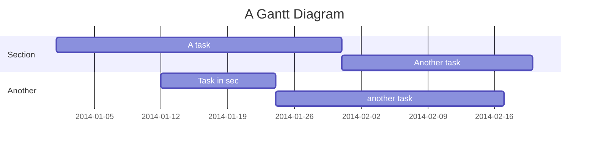

# Web Site Rewrite Project

## Menu Assignments Plantuml Wireframe

```plantuml
@startsalt
    {
      {T
         +<color:orange>About Us
         ++<color:green>Mission Statement
         ++<color:green>Contact Us
         ++<color:green>Who's Who
         ++<color:green>Committees
         +<color:green>Judaica
         +<color:green>Tikkun Olam
         ++<color:green>Contributions
         ++<color:green>Mitzvot
         ++<color:green>Donate
         +<color:orange>Current Events
         ++<color:green>Calendar
         ++<color:green>Stay Connected
         +<color:orange>Worship
         ++<color:green>Service Etiquette
         ++<color:green>Services
         +<color:orange>Education
         ++<color:green>Religioius School
         ++<color:green>Nursery School
         ++<color:green>Confirmation Class
         ++<color:green>Adult Education
         ++<color:green>Library
         ++<color:green>Ritual
         +<color:orange>Activities
         ++<color:green>Sisterhood
         ++<color:green>Kadima
         ++<color:green>USY
         ++<color:green>Men's Club
         ++<color:green>Other ClubS
      }
    }
@endsalt

```

## Mermaid Gantt

## Resources

* [PlantText UML Editor](https://www.planttext.com/)
* [Mermaid live editor](https://mermaid-js.github.io/mermaid-live-editor/#/edit/eyJjb2RlIjoiZ2FudHRcbiAgICB0aXRsZSBBIEdhbnR0IERpYWdyYW1cbiAgICBkYXRlRm9ybWF0ICBZWVlZLU1NLUREXG4gICAgc2VjdGlvbiBTZWN0aW9uXG4gICAgQSB0YXNrICAgICAgICAgICA6YTEsIDIwMTQtMDEtMDEsIDMwZFxuICAgIEFub3RoZXIgdGFzayAgICAgOmFmdGVyIGExICAsIDIwZFxuICAgIHNlY3Rpb24gQW5vdGhlclxuICAgIFRhc2sgaW4gc2VjICAgICAgOjIwMTQtMDEtMTIgICwgMTJkXG4gICAgYW5vdGhlciB0YXNrICAgICAgOiAyNGQiLCJtZXJtYWlkIjp7InRoZW1lIjoiZGVmYXVsdCJ9fQ)