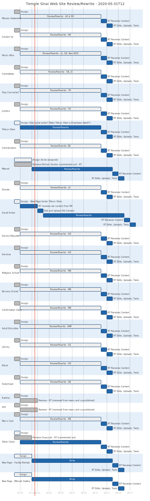

# Web Site Rewrite Project

## 2020-06-18 A Watershed

It has now become obvious that for some pages a more involved flow is needed. `Assign->Rewrite->Post` won't do for:

- [Mission Statement](mission-statement.md)
- [Donations](donations.md)
- [Social Action](social-action.md)

So look for more complexity in Gantt charts from now on. Other pages might need more steps. These are just the ones I'm aware of at the moment. 

I'm thinking about calling a meeting to address just the donations. There's a bunch of stuff to unpack, including tasks we agreed on at the last meeting that seem to have receded in peoples' mindsets.

## 2020-05-27 Kickoff

We're kicking this off at the end of May, beginning of June. We'll assign each page to its appropriate group/person and Rich will update the site pages with the contributed content.

2020-05-27T11-04:00 - Sent e-mail to Jo for assignment suggestions. Sent my list.

I'll be using Gantt charts to track progress.

Notes:

- Most recent chart appears first.
- The bottom horizontal axis is a date labeled timeline.
- Dark gray tasks are done.
- Light gray tasks with a blue border are in progress.
- Dark blue tasks are to be done after tasks in progress
- Red tasks are critical.
- My comments and questions precede each graphic.

----

### Gantt Chart as of June 19, 2020-06-19T14

So, yeah I just got around to incorporating info from the first publicity into the chart. It turns out we havew some critical work to do for pages with forms: assess and evaluate Rakefet. We need to know to what extent we are going to use Rakefet's features, especially accepting credit card payments (contributions, donations, selling scrip).

This needs to happen preferably *before* any work on accepting payments on the site gets done.

### Gantt Chart as of June 12, 2020-06-12T10

We now have two iterations of the Men's Club page. I got Rose's rewrite formatted over the last couple of days and uploaded it this morning.

I also added some space between the Sisterhood membership tables.

I think I also put the finishing touches on the css for the unordered lists. Turns out I inadvertently reset all ul's besides 'staritem' to have no styling. I fixed that by adding the 'staritem' class specifier in the reset css.

### Gantt Chart as of June 09, 2020-06-09T14

Had to redo the chart. I realized that all the "unassigned" pages looked like they're in the process of being assigned; it was hard to visualize where we haven't progressed. *So*... for pages that have a solid blue line of activity from the left side of the page to the right are ones that we haven't made any progress with ... at all. Haven't even been assigned to anyone.

Estimated completion is 6/31.

### Gantt Chart as of June 08, 2020-06-08T12

Sisterhood page is done. Yay!

Given that two pages are done and the rabbi selection is ongoing I'm pushing the timeline out another week. The estimated finish is June 25.

Questions from the first gantt chart are still unanswered.

### Gantt Chart as of May 31, 2020-05-31T12

Did this stuff:

- Commented out Kitchen section on "Mitzvot" page.
- Removed Kadima and USY pages from activities menu. Unpublished both pages.
- Commented out Chavura section on "Other Clubs" page.

All questions from last gantt remain open.

### Gantt Chart as of May 28, 2020-05-28T18

I'm still not clear who has been assigned the following pages:
- Tikkun Olam
- Mitzvot
- Social Action
- Other Clubs
- Facility Rentals
- Mitzvah Gallery

We have to fix the menu order for these:
- Tikkun Olam
- Social Action

**Is the current "Tikkun Olam" page what will become the "Social Action" page?**

We have to assign writers and find menu spots for these new pages:
- Facility Rentals
- Mitzvah Gallery

With a rewrite window of two weeks we are looking at a completion date of June 17, 2020.

## Resources

* [PlantText UML Editor](https://www.planttext.com/)
* [Mermaid live editor](https://mermaid-js.github.io/mermaid-live-editor/#/edit/eyJjb2RlIjoiZ2FudHRcbiAgICB0aXRsZSBBIEdhbnR0IERpYWdyYW1cbiAgICBkYXRlRm9ybWF0ICBZWVlZLU1NLUREXG4gICAgc2VjdGlvbiBTZWN0aW9uXG4gICAgQSB0YXNrICAgICAgICAgICA6YTEsIDIwMTQtMDEtMDEsIDMwZFxuICAgIEFub3RoZXIgdGFzayAgICAgOmFmdGVyIGExICAsIDIwZFxuICAgIHNlY3Rpb24gQW5vdGhlclxuICAgIFRhc2sgaW4gc2VjICAgICAgOjIwMTQtMDEtMTIgICwgMTJkXG4gICAgYW5vdGhlciB0YXNrICAgICAgOiAyNGQiLCJtZXJtYWlkIjp7InRoZW1lIjoiZGVmYXVsdCJ9fQ)